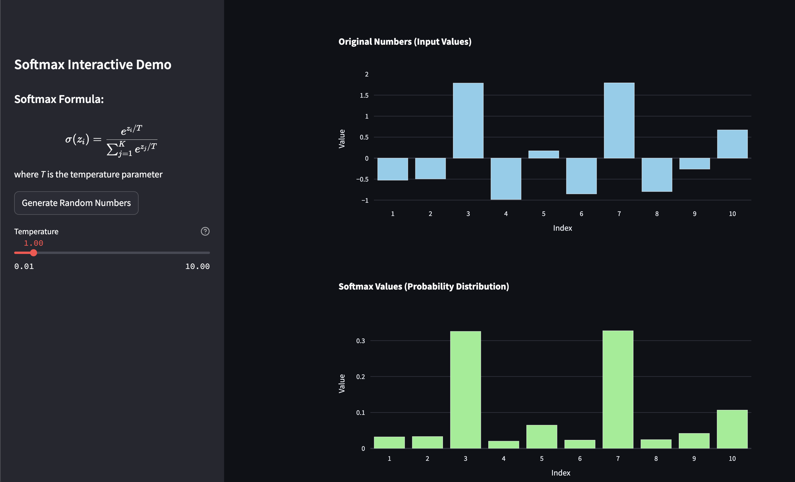

# 🧠 Interactive Softmax Visualization 📊

This project provides an interactive demonstration of the softmax function, allowing users to visualize how it transforms input values and how temperature affects the output distribution. It's an educational tool designed to help understand the role of temperature in sampling from Large Language Models (LLMs).



## 🤔 What is Softmax?

The softmax function is a fundamental mathematical operation in machine learning that converts a vector of real numbers into a probability distribution. It's particularly important in:

- Classification tasks in neural networks
- Output layer of language models
- Probability distribution generation

The softmax function takes a vector of K real numbers and normalizes it into a probability distribution of K probabilities that sum to 1. For each input value z_i, the softmax function is defined as:

σ(z_i) = e^(z_i) / Σ(e^(z_j))

where:
- e is Euler's number (≈ 2.71828)
- z_i is the input value at position i
- Σ represents the sum over all input values j

## 🌡️ What is Temperature?

In the context of LLMs and the softmax function, temperature is a hyperparameter that controls the randomness of predictions. It's called "temperature" as an analogy to statistical physics, where high temperatures lead to more random behavior.

- 🔥 High temperature (T > 1) makes the output distribution more uniform and random.
- ❄️ Low temperature (0 < T < 1) makes the output more deterministic, focusing on the highest probability options.
- 🧊 As temperature approaches 0, it becomes equivalent to a simple argmax operation.

## 🖥️ What This Code Does

The `app.py` file creates a Streamlit application that:

1. Generates random input values
2. Applies the softmax function with a user-adjustable temperature
3. Visualizes both the input values and the resulting probability distribution

Users can interactively change the temperature and see how it affects the softmax output in real-time.

## 🚀 Getting Started

### Windows

1. Open Command Prompt
2. Create and activate a virtual environment:
   ```
   python -m venv venv
   venv\Scripts\activate
   ```
3. Install requirements:
   ```
   pip install -r requirements.txt
   ```
4. Run the app:
   ```
   streamlit run app.py
   ```

### macOS/Linux

1. Open Terminal
2. Create and activate a virtual environment:
   ```
   python3 -m venv venv
   source venv/bin/activate
   ```
3. Install requirements:
   ```
   pip install -r requirements.txt
   ```
4. Run the app:
   ```
   streamlit run app.py
   ```

## 📚 Learn More

This demonstration helps visualize how temperature affects probability distributions in LLMs. By adjusting the temperature, you can see how it influences the "sharpness" or "flatness" of the output distribution, which is crucial in tasks like text generation where balancing creativity and coherence is important.

Enjoy exploring the softmax function and happy learning! 🎉

